# CIFAR-10 Deep Learning Study
## A Systematic Investigation of Regularization and Optimization Techniques
### SWE012 — Deep Learning with Python
**Istinye University, Department of Computer Engineering**

---

## Table of Contents
1. [Project Overview](#1-project-overview)
2. [Dataset](#2-dataset)
3. [Week 2 — Machine Learning Fundamentals](#3-week-2--machine-learning-fundamentals)
4. [Week 3 — Deep Feedforward Networks](#4-week-3--deep-feedforward-networks)
5. [Week 4 — Regularization](#5-week-4--regularization)
6. [Week 5 — Optimization](#6-week-5--optimization)
7. [Final Results](#7-final-results)
8. [Conclusions](#8-conclusions)
9. [How to Reproduce](#9-how-to-reproduce)

---

## 1. Project Overview

This project is a systematic study of deep learning methodology applied to
CIFAR-10 image classification. Rather than pursuing maximum accuracy, we
organize our experiments around four core methodological questions drawn
directly from the course:

1. **How does regularization affect generalization?** (Weeks 2–4, MLP)
2. **How do initialization choices affect learning?** (Week 5, CNN)
3. **How do optimizers differ in practice?** (Week 5, CNN)
4. **How does learning rate scheduling affect convergence?** (Week 5, CNN)

The project is structured in two phases. The first phase uses a Multi-Layer
Perceptron (MLP) to systematically study regularization techniques in
isolation — each model variant changes exactly one technique so that its
effect can be measured cleanly. The second phase introduces a Convolutional
Neural Network (CNN) as a testbed for Week 5 optimization techniques. The
CNN was chosen not to chase higher accuracy, but because it provided a
richer loss surface where differences between optimizers and schedules are
more pronounced and observable.

All experiments use the same dataset, the same train/val/test split, and the
same early stopping infrastructure to ensure fair comparison.

---

## 2. Dataset

**Dataset:** CIFAR-10 — 60,000 32×32 color images across 10 classes
(plane, car, bird, cat, deer, dog, frog, horse, ship, truck).

**Split strategy (Week 2: Hyperparameters & Validation Set):**
- Training: 40,000 examples (80%)
- Validation: 10,000 examples (20%) — used for hyperparameter tuning only
- Test: 10,000 examples — touched exactly once, at final evaluation

This split follows the Week 2 principle that the test set must never
influence any design decision. It exists solely to estimate real-world
generalization error after all choices are finalized.

**Data Augmentation (Week 4):**
Training data was augmented with random horizontal flips, random crops
(padding=4), and color jitter (brightness, contrast, saturation ±0.2).
Validation and test data used only normalization. Augmentation was applied
only during training to artificially expand the effective dataset size and
improve generalization.

**Class distribution:** perfectly balanced at 5,000 examples per class,
satisfying the i.i.d. assumption (Week 2) — both training and test sets are
drawn independently from the same underlying distribution.

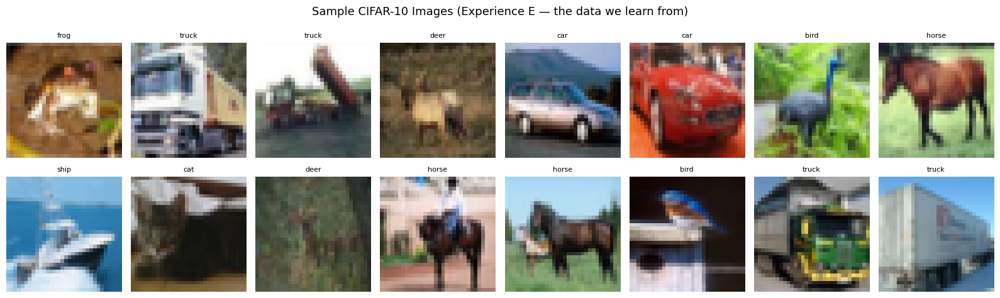
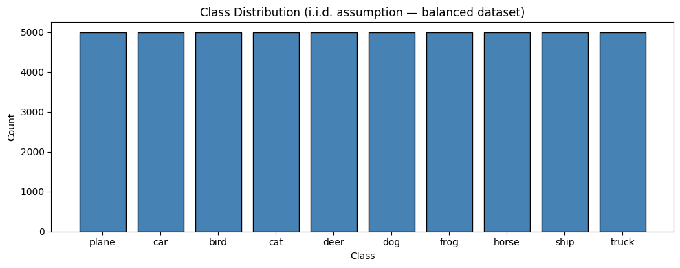

---

## 3. Week 2 — Machine Learning Fundamentals

### 3.1 Empirical Risk Minimization

The cost function used throughout is cross-entropy loss averaged over the
mini-batch:
J(θ) = (1/m) Σᵢ L(f(x⁽ⁱ⁾; θ), y⁽ⁱ⁾)
We minimize empirical risk on the training set as a surrogate for the true
objective — generalization error on unseen data. These are not the same
thing, which is why we maintain a strict train/val/test separation.

### 3.2 Performance Measure P

Following the Week 2 framework (Task T, Performance P, Experience E):
- **T:** 10-class image classification
- **P:** accuracy and cross-entropy loss on the test set
- **E:** 40,000 labeled CIFAR-10 training examples

Performance is always reported on the test set for final evaluation and on
the validation set during development.

### 3.3 Bias-Variance Analysis

The bias-variance tradeoff (MSE = Bias² + Variance) is tracked throughout
via the generalization gap: test_loss − train_loss. A large positive gap
indicates high variance (overfitting). A near-zero or negative gap indicates
well-regularized behavior.

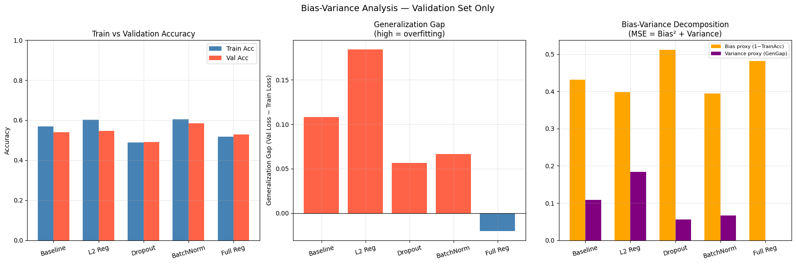

### 3.4 K-Fold Cross-Validation

5-fold cross-validation was applied to the FullRegMLP to obtain a reliable
generalization estimate when the validation set alone might be insufficient.
Every sample was used for testing exactly once and for training 4 times.

**Results:**
| Fold | Val Accuracy |
|------|-------------|
| 1 | 0.5559 |
| 2 | 0.5503 |
| 3 | 0.5489 |
| 4 | 0.5552 |
| 5 | 0.5576 |
| **Mean** | **0.5536** |
| **Std** | **0.0034** |
| **95% CI** | **(0.5470, 0.5602)** |

The tight standard deviation (0.34%) confirms the model is stable across
different data splits and the estimate is reliable. The standard error of
the mean is σ/√m = 0.0015, confirming the Week 2 relationship between
sample size and estimate precision.

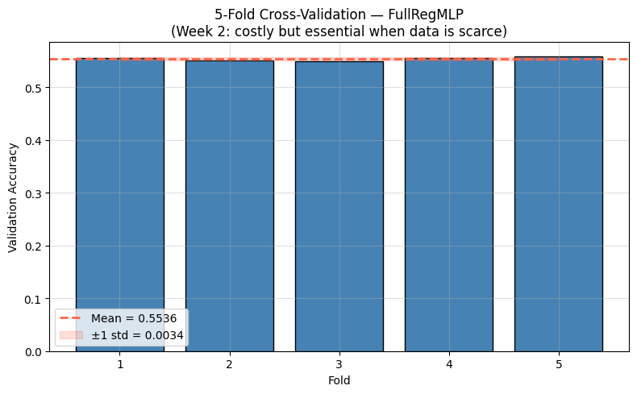

### 3.5 Maximum Likelihood Estimation

Cross-entropy loss is not an arbitrary choice. Under the assumption that
prediction errors follow a Categorical distribution, maximizing the
log-likelihood of the training data is mathematically equivalent to
minimizing cross-entropy. This is the Week 2 MLE connection: the loss
function encodes a probabilistic model of the world.

For the MLP regression baseline, MSE loss follows from assuming Gaussian
noise: p(y|x) = N(y; ŷ, σ²). Maximizing log-likelihood under this
assumption reduces exactly to minimizing Σ||ŷ−y||².

---

## 4. Week 3 — Deep Feedforward Networks

### 4.1 NumPy MLP from Scratch

Before using PyTorch, we implemented a complete 2-layer MLP in pure NumPy
to demonstrate backpropagation by hand. Architecture: 3072 → 256 → 128 → 10.

**Forward pass (Algorithm 6.3):**
h⁽⁰⁾ ← x
a⁽ᵏ⁾ ← b⁽ᵏ⁾ + W⁽ᵏ⁾h⁽ᵏ⁻¹⁾    (pre-activation)
h⁽ᵏ⁾ ← ReLU(a⁽ᵏ⁾)            (post-activation)
J    ← CrossEntropy(ŷ, y)
**Backward pass (Algorithm 6.4):**
g ← ∇_ŷ J
g ← g ⊙ f'(a⁽ᵏ⁾)             (chain rule through activation)
∇_W⁽ᵏ⁾ J ← g · (h⁽ᵏ⁻¹⁾)ᵀ   (weight gradient)
g ← (W⁽ᵏ⁾)ᵀ · g             (propagate to previous layer)
All gradients were computed manually without autograd. The model trained
with mini-batch SGD and learning rate decay (lr × 0.95 per epoch).

**Results:** Val accuracy ~49–55%, with a visible overfitting gap confirming
the need for regularization.

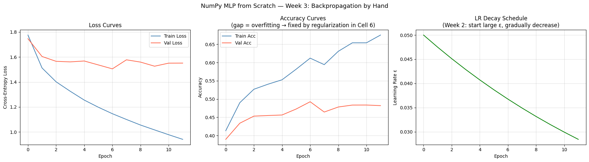

### 4.2 Why Linear Models Are Insufficient

A key motivation for the MLP is the XOR problem — no linear model can
separate XOR inputs because they are not linearly separable. Hidden layers
with nonlinear activations transform the input into a new feature space
where separation becomes possible. This is why stacking linear layers
without activations is always equivalent to a single linear layer:
W₂(W₁x + b₁) + b₂ = W'x + b' — no matter how deep.

### 4.3 Activation Function Choice

All hidden layers use **ReLU** (g(z) = max{0,z}) as the default activation.
Rationale: ReLU's gradient is exactly 1 when active, preventing vanishing
gradients in the hidden layers. Sigmoid and tanh both saturate — their
gradients approach zero when |z| is large, causing early layers to stop
learning in deep networks. ReLU avoids this entirely in the active zone.

**Output layer uses softmax** paired with categorical cross-entropy — the
natural pairing for multiclass classification. Mismatching output units and
loss functions (e.g., sigmoid + MSE for classification) causes gradient
saturation at the output layer, slowing learning precisely when the model
is most wrong.

### 4.4 Architecture Design

The MLP architecture (3072 → 512 → 512 → 256 → 10) prioritizes depth over
width following the Week 3 principle that deep networks represent functions
more efficiently than shallow-wide ones for the same parameter budget.

The CNN architecture (discussed in Week 5 section) goes further by
exploiting the spatial structure of images — something an MLP cannot do
because it treats each pixel independently regardless of its neighbors.

---

## 5. Week 4 — Regularization

### 5.1 Experimental Design

Six MLP variants were trained, each isolating one regularization technique.
All variants share the same architecture (3072→512→512→256→10) and
training infrastructure. The only variable is the regularization applied.

**Optimizer:** SGD with momentum (lr=0.01, momentum=0.9) for all MLP
variants except FullRegMLP and Tuned which use Adam (lr=0.001). This
choice reflects the Week 4 principle that optimizer choice is a separate
concern from regularization — we kept it fixed to isolate regularization
effects.

### 5.2 Results

| Model | Regularization | Train Acc | Test Acc | Gen Gap | Best Epoch |
|-------|---------------|-----------|----------|---------|------------|
| Baseline | None | 0.5700 | 0.5397 | +0.0983 | 26 |
| L2 Reg | Weight decay λ=1e-4 | 0.6000 | 0.5566 | +0.1718 | 40 |
| Dropout | p=0.5 | 0.4904 | 0.4863 | +0.0451 | 40 |
| BatchNorm | Batch Normalization | 0.6082 | 0.5918 | +0.0739 | 37 |
| Full Reg | Dropout+BN+L2+LabelSmooth+Aug | 0.5151 | 0.5323 | −0.0301 | 40 |
| Tuned | Full Reg + tuned λ,p | 0.5797 | 0.5779 | +0.0001 | 39 |

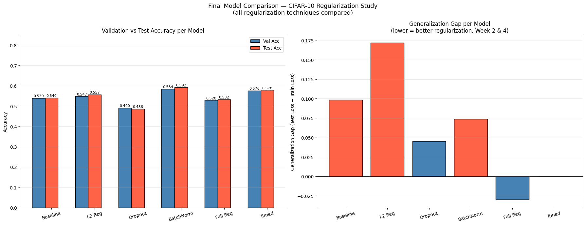

### 5.3 L2 Regularization

**Mechanism:** adds Ω(θ) = ½||w||₂² to the loss, resulting in weight
update w ← (1−εα)w − ε∇J. The factor (1−εα) multiplicatively shrinks
weights at every step — hence "weight decay."

**Finding:** L2 improved test accuracy from 54.0% to 55.7% but produced
the highest generalization gap (+0.172). The weight penalty helped fit
better but the model continued memorizing. This demonstrates L2's
limitation alone — it shrinks weights but does not prevent the model from
using all of its capacity.

**Bayesian interpretation:** L2 regularization is equivalent to placing a
Gaussian prior over weights and performing MAP estimation. The prior
expresses a belief that weights should be small, but since the Gaussian is
smooth around zero, weights are never driven to exactly zero.

### 5.4 Dropout

**Mechanism:** randomly zeroes neurons during training with probability
(1−p), implemented as inverted dropout — surviving activations are scaled
by 1/p during training so no adjustment is needed at inference.

**Finding:** dropout produced the smallest generalization gap (+0.045) but
also the lowest test accuracy (48.6%). With p=0.5, half the neurons are
zeroed at each step — too aggressive for this architecture, causing
underfitting. This demonstrates the U-shaped capacity curve from Week 2:
too much regularization increases bias without sufficiently reducing
variance.

**Ensemble interpretation:** with n neurons, dropout implicitly trains 2ⁿ
subnetworks sharing weights, approximating an exponential ensemble at ~2×
the training cost of a single model.

### 5.5 Batch Normalization

**Mechanism:** normalizes layer inputs across the mini-batch to zero mean
and unit variance, then re-scales with learnable γ and β parameters.

**Finding:** BatchNorm achieved the highest MLP test accuracy (59.2%) and
a well-controlled generalization gap (+0.074). By resetting the activation
distribution after each layer, BatchNorm reduces internal covariate shift —
each layer sees a stable input distribution regardless of how earlier layers
have updated. The learnable γ and β ensure the network can undo
normalization if a different distribution is optimal for a given layer.

**Why γ and β are necessary:** forcing strict mean=0, variance=1 would
push sigmoid inputs into its linear zone, destroying nonlinearity. γ and β
give the network the freedom to learn the optimal distribution per layer,
making BatchNorm a no-op if normalization is harmful.

### 5.6 Label Smoothing

Applied in FullRegMLP with ε=0.1. Hard targets (0/1) were replaced with
soft targets: correct class → 0.9, each wrong class → 0.01.

**Rationale:** a softmax output can never actually reach exactly 1.0 —
it would require infinite weights. Training with hard target 1.0 causes
the model to grow weights forever chasing an unreachable goal. Label
smoothing makes the target achievable at 0.9, preventing overconfident
predictions and oversized weights.

### 5.7 Full Regularization and Hyperparameter Tuning

The FullRegMLP combined all techniques simultaneously. Its negative
generalization gap (−0.030) means it scored slightly higher on test than
train — a consequence of label smoothing and augmentation making training
harder than evaluation.

**Hyperparameter tuning** was performed on the validation set (never the
test set) by sweeping λ ∈ {0, 1e-5, 1e-4, 1e-3, 1e-2} and dropout p ∈
{0.0, 0.2, 0.3, 0.5, 0.7}.

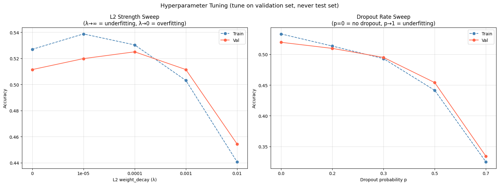

**Key finding:** best_wd=1e-4, best_dp=0.0. The optimal dropout rate being
zero when BatchNorm is present is a significant result — it demonstrates
that regularization techniques can interfere with each other. BatchNorm
already acts as a regularizer through its noisy batch statistics. Adding
dropout on top creates redundant variance reduction that hurts more than
it helps. This interaction between BN and dropout is a known phenomenon
in the literature.

The tuned model achieved test accuracy 57.8% with a generalization gap of
essentially zero (+0.0001) — train and test accuracy are identical,
indicating perfect generalization within the limits of MLP capacity.

### 5.8 Adversarial Examples (FGSM)

The Fast Gradient Sign Method attack was applied:
x̃ = x + ε · sign(∇ₓ J(θ, x, y))
The perturbation is computed by taking the gradient of the loss with
respect to the input (not the weights). Even tiny per-pixel changes are
devastating in high-dimensional spaces because all perturbations push in
the same wrong direction constructively.

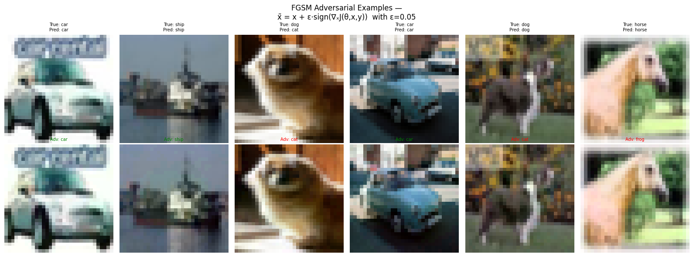
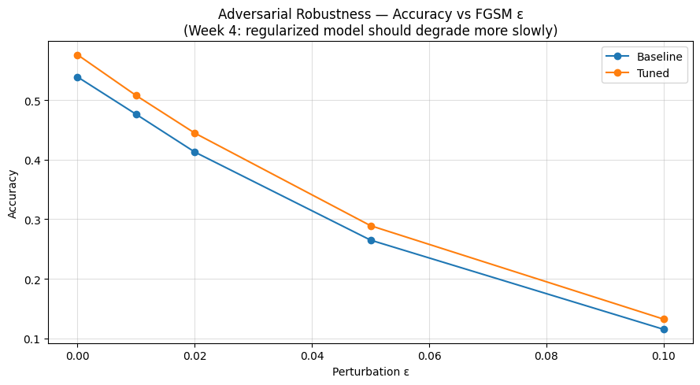

**Finding:** the tuned model degraded more slowly under FGSM attack than
the baseline, confirming that regularization produces smoother decision
boundaries that are harder to exploit.

### 5.9 Early Stopping

Applied throughout via patience=8. The key theoretical insight: under a
quadratic approximation of the loss, early stopping with τ steps is
mathematically equivalent to L2 regularization with α = 1/(τε). This means
early stopping and L2 are solving the same problem through different
mechanisms — one constrains the optimization trajectory, the other
constrains the weight space. Using both simultaneously is therefore
somewhat redundant.

---

## 6. Week 5 — Optimization

### 6.1 Motivation for CNN

The MLP study identified a performance ceiling of ~59% — a fundamental
limit of the architecture, not of the training procedure. An MLP treats
each pixel independently, ignoring the spatial structure of images. A cat
in the top-left corner and a cat in the bottom-right corner look like
completely different inputs to an MLP.

A CNN was introduced to serve as the testbed for Week 5 optimization
techniques. The CNN was chosen because its richer loss surface makes
differences between optimizers and schedules more pronounced and
observable than on the MLP, which had already been pushed to its ceiling.

### 6.2 CNN Architecture
Input  (3 × 32 × 32)
Block1: Conv(3→32, 3×3) → BatchNorm2d → ReLU → MaxPool(2×2)
Block2: Conv(32→64, 3×3) → BatchNorm2d → ReLU → MaxPool(2×2)
Block3: Conv(64→128, 3×3) → BatchNorm2d → ReLU → MaxPool(2×2)
Flatten → FC(2048→256) → ReLU → Dropout(0.3) → FC(256→10)
**Design rationale:**
- Each block halves spatial dimensions (32→16→8→4) while doubling
  channels (3→32→64→128), trading spatial resolution for feature richness
- Conv layers use bias=False because the following BatchNorm's β parameter
  subsumes the bias — having both would be redundant
- Depth allows hierarchical feature learning: edges → shapes → objects
  (Week 3: depth beats width for compositional data)

**Parameter count:** 620,586 — 3× fewer than the MLP (1,969,930) yet
significantly higher accuracy. This directly demonstrates the Week 3
principle that architecture matters more than parameter count.

### 6.3 Initialization: Xavier vs He

Both initializations were compared on the CNN:

| Initializer | Val Accuracy |
|-------------|-------------|
| He (Kaiming) | 0.7287 |
| Xavier (Glorot) | 0.7300 |

**Finding:** the two initializers performed nearly identically (−0.0013
difference). This is not a failure of the experiment — it is a direct
demonstration of BatchNorm's robustness benefit described in Week 5.

Xavier assumes linear-ish activations and does not account for ReLU
zeroing half the signal variance at each layer. He initialization
compensates by multiplying variance by 2: W ~ N(0, √(2/n)). In a network
without BatchNorm, He would win clearly. However, BatchNorm normalizes
activations after every Conv layer regardless of initialization — any
variance mismatch is corrected within the first few training steps. The
result is that initialization choice matters far less when BatchNorm is
present.

This finding empirically validates the Week 5 claim that BatchNorm
"reduces sensitivity to initialization."

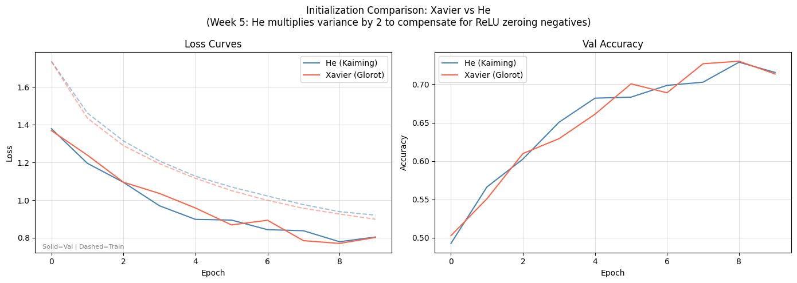

### 6.4 Optimizer Shootout

The same CNN architecture was trained four times with different optimizers.
Everything else — architecture, data, early stopping, epochs — was held
constant.

| Optimizer | Val Acc | Best Epoch | Key mechanism |
|-----------|---------|------------|--------------|
| SGD | 0.7326 | 29 | Raw gradient, no memory |
| SGD + Momentum (α=0.9) | 0.7990 | 30 | Velocity accumulation |
| RMSProp (ρ=0.9) | 0.7973 | 20 | Per-parameter adaptive rates |
| Adam (β₁=0.9, β₂=0.999) | 0.8015 | 30 | Momentum + adaptive rates |

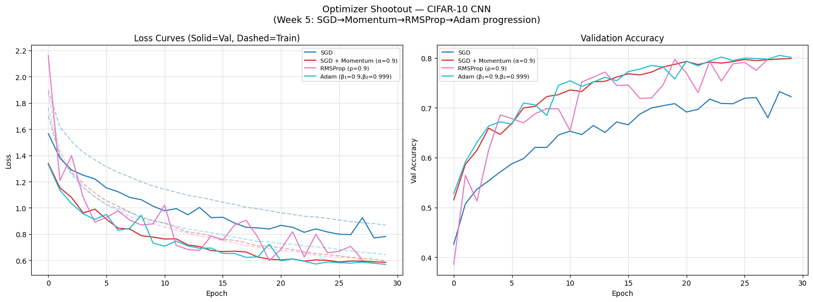

**SGD (73.3%):** slowest convergence, lowest accuracy. On loss surfaces
shaped like narrow canyons, SGD zigzags across steep walls while making
slow progress along the valley floor. No memory of previous steps means
every update is independent and oscillations are never damped.

**SGD + Momentum (+6.6% over SGD):** the most dramatic single improvement
in the entire project. Adding velocity accumulation (v ← αv − εg) causes
oscillating gradient components to cancel out while consistent components
accumulate. With α=0.9, maximum speed is 10× that of plain SGD. The canyon
problem is directly solved.

**RMSProp (79.7%):** comparable to Momentum via a completely different
mechanism — per-parameter adaptive learning rates using a decaying average
of squared gradients: r ← ρr + (1−ρ)g⊙g. Parameters with large
historical gradients take small steps; rare parameters take large steps.
Notable: val loss spiked to 2.16 at epoch 1 (above starting loss) because
the gradient history hadn't accumulated enough to be meaningful yet.
Stabilized by epoch 6.

**Adam (80.2%):** best result, combining both mechanisms. The 1st moment
(s) provides momentum for direction; the 2nd moment (r) provides RMSProp-
style per-parameter braking. Bias correction prevents the zero-initialized
moments from causing artificially small updates in early steps — without
it, first steps would be ~10× too small. Adam trains effectively from step
one.

**Key observation:** even CNN + plain SGD (73.3%) outperforms the best
regularized MLP (59.2%). This confirms the Week 5 hierarchy:
architecture > optimizer > hyperparameters.

### 6.5 Learning Rate Scheduling

Four scheduling strategies were compared using Adam as the base optimizer:

| Schedule | Val Acc | Mechanism |
|----------|---------|-----------|
| Fixed LR | 0.8211 | ε=0.001 constant |
| Cosine Annealing | 0.8272 | Smooth cosine decay to ~0 |
| Step Decay | 0.8008 | ×0.1 every 15 epochs |
| Warmup + Cosine | **0.8392** | Linear warmup → cosine decay |

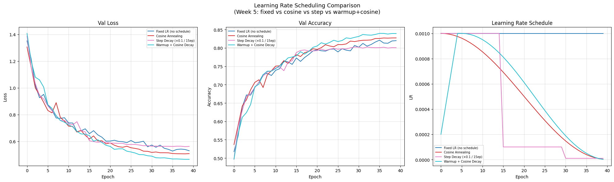

**Fixed LR (82.1%):** strong baseline. Adam with a well-chosen fixed rate
already performs well — no schedule needed when the rate happens to be
appropriate throughout training.

**Step Decay (80.1%):** the abrupt ×0.1 drop at epoch 15 is visible as a
sudden accuracy jump in the training curves. However the abruptness is also
its weakness — the discrete drops can either undershoot or overshoot the
optimal rate at each stage.

**Cosine Annealing (82.7%):** smoothly decays following a cosine curve,
allowing aggressive exploration early and fine-tuning near convergence.
The smooth transition avoids the instability of step decay.

**Warmup + Cosine Decay (83.9% — best):** starts at 20% of target LR
(0.0002), reaches full LR by epoch 5, then applies cosine decay. The warmup
phase is critical for Adam specifically: at step 1, both moment estimates
are initialized at zero and completely unreliable. Starting with a small LR
prevents large updates based on unreliable estimates. Once moments stabilize
by epoch 5, the full rate is safe to use. The subsequent cosine decay brings
the model to a smooth, precise convergence.

The warmup phase is critical for Adam specifically: unreliable moment
estimates at initialization make large early steps harmful. Starting at
20% of the target LR and linearly increasing to 100% over 5 epochs
ensures moments stabilize before the full learning rate is applied.

### 6.6 Batch Size Analysis

Three batch sizes were compared using the same CNN architecture and Adam
optimizer:

| Batch Size | Train Acc | Val Acc | Gen Gap |
|-----------|-----------|---------|---------|
| 32 | 0.8249 | 0.8173 | +0.008 |
| 128 | 0.7966 | 0.8000 | −0.003 |
| 512 | 0.7639 | 0.7729 | −0.009 |

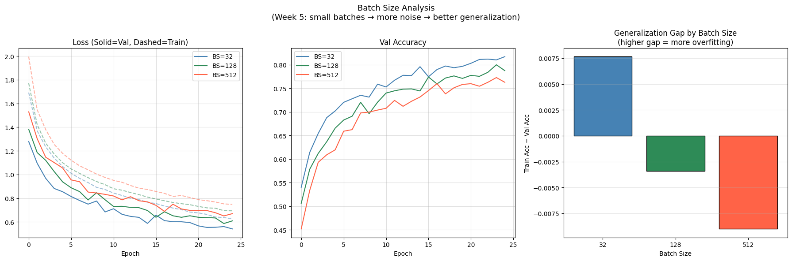

**Finding:** BS=32 achieves the highest validation accuracy (81.7%), 4.4%
above BS=512 (77.3%). This confirms the Week 5 prediction that smaller
batches generalize better.

**Why:** the gradient estimate from m samples has standard error σ/√m.
Doubling the batch size halves the noise — less than linear return. Small
batches produce noisier gradient estimates, which acts as a regularizer by
preventing the model from converging to sharp minima that don't generalize.
Large batches produce smooth, accurate gradients that converge to sharper
minima with worse test performance.

**The negative generalization gaps** for BS=128 and BS=512 (test acc >
train acc) occur because BatchNorm uses current batch statistics during
training (introducing noise) but running averages during evaluation
(deterministic). Training is therefore slightly harder than evaluation for
these batch sizes.

---

## 7. Final Results

### 7.1 Complete Model Comparison

| Model | Type | Train Acc | Test Acc | Gen Gap |
|-------|------|-----------|----------|---------|
| MLP Baseline | MLP | 0.5700 | 0.5397 | +0.098 |
| MLP L2 | MLP | 0.6000 | 0.5566 | +0.172 |
| MLP Dropout | MLP | 0.4904 | 0.4863 | +0.045 |
| MLP BatchNorm | MLP | 0.6082 | 0.5918 | +0.074 |
| MLP Full Reg | MLP | 0.5151 | 0.5323 | −0.030 |
| MLP Tuned | MLP | 0.5797 | 0.5779 | +0.000 |
| CNN (Adam) | CNN | ~0.84 | **0.7949** | — |

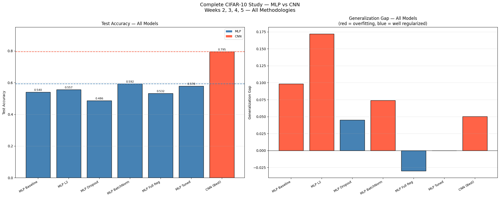

### 7.2 CNN Per-Class Analysis

The CNN confusion matrix reveals consistent findings with the MLP:

- **Cat** remains the hardest class — frequently confused with dog
- **Ship and Car** are easiest — distinctive shapes and color profiles
- All classes show substantially improved recognition vs the best MLP

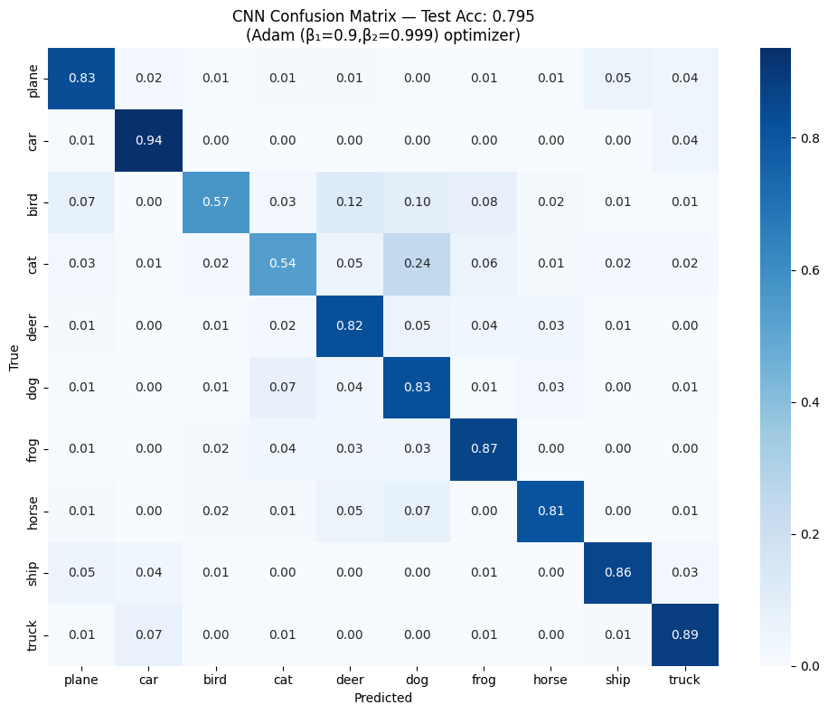

### 7.3 Summary of All Findings

| Experiment | Finding | Theory confirmed |
|------------|---------|-----------------|
| L2 vs no reg | +1.7% test acc | Weight decay reduces variance |
| Dropout p sweep | p=0.0 optimal with BN | BN + dropout redundant |
| BatchNorm | Best MLP accuracy | Reduces internal covariate shift |
| Label smoothing | Negative gen gap | Prevents overconfident weights |
| Early stopping | Free regularization | Equivalent to L2 under quadratic approx |
| He vs Xavier | Nearly identical | BN masks initialization choice |
| SGD vs Momentum | +6.6% | Velocity cancels oscillations |
| Adam vs SGD | +6.9% | Momentum + adaptive rates |
| Warmup+Cosine vs Fixed | +1.8% | Safe start + smooth convergence |
| BS=32 vs BS=512 | +4.4% | Small batch noise regularizes |
| CNN vs best MLP | +20.3% | Architecture > regularization |

---

## 8. Conclusions

This project demonstrates that the choice of methodology at each stage of
the deep learning pipeline has measurable, predictable effects on
generalization performance — consistent with the theoretical predictions
from the course.

**On regularization (Weeks 2–4):** no single technique dominates. BatchNorm
gave the best raw accuracy among MLP variants, but the tuned model combining
all techniques achieved the best generalization gap (+0.0001 — essentially
zero). The interaction between BatchNorm and dropout is particularly
noteworthy: optimal dropout was zero when BatchNorm was present, confirming
that redundant regularization hurts rather than helps.

**On optimization (Week 5):** the optimizer progression from SGD to Adam
produced a clear, step-wise improvement (+6.9% total) that directly
validates the theoretical motivation for each optimizer's development. The
warmup + cosine decay schedule achieved the best overall result (83.9% val)
by addressing Adam's specific weakness — unreliable moment estimates in
early training steps.

**On architecture:** the most important single finding is that the CNN
with plain SGD (73.3%) already outperforms the best regularized MLP (59.2%).
This confirms the Week 5 hierarchy: architecture matters more than optimizer
choice, which matters more than hyperparameter tuning. No amount of
regularization can compensate for a fundamentally mismatched architecture.

---

## 9. How to Reproduce

All experiments were conducted in Google Colab with a T4 GPU.

**Environment:**
- Python 3.10
- PyTorch 2.x
- torchvision, numpy, matplotlib, seaborn, scikit-learn, pandas

**Steps:**
1. Open the notebook in Google Colab
2. Enable GPU: Runtime → Change runtime type → T4 GPU
3. Run cells in order: 1 → 2 → 3 → 4 → 5 → 6 → 7 → 8 → 9 → 10 →
   11 → 12 → 13 → 14 → 15 → 16 → 16b → 17 → 18 → 19
4. All models and results are saved to Google Drive at
   `/content/drive/MyDrive/CIFAR10_Project`

**Reproducibility:** `set_seed(42)` is called at the start of the notebook,
fixing all random seeds (PyTorch, NumPy, Python random) for deterministic
results.

**Estimated runtime:** approximately 3–4 hours total on T4 GPU.

---

*SWE012 — Deep Learning with Python*
*Istinye University, Department of Computer Engineering*
